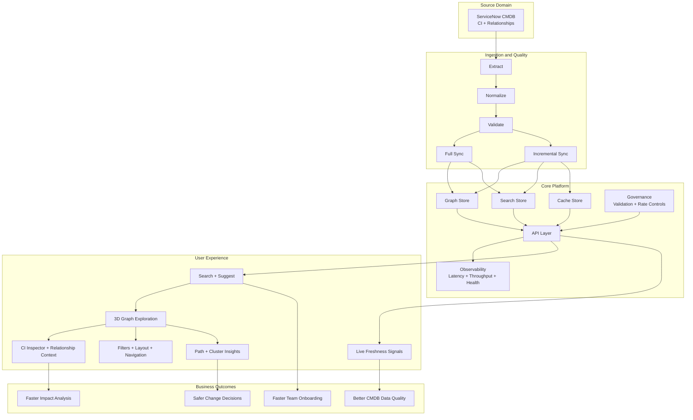
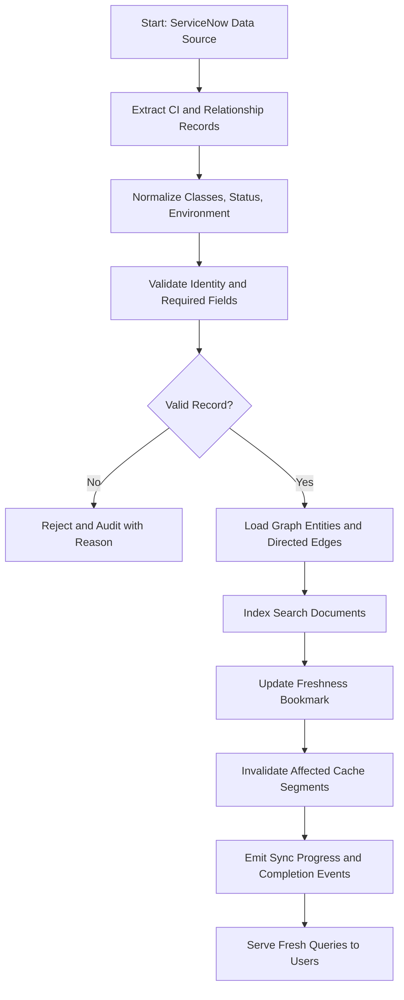
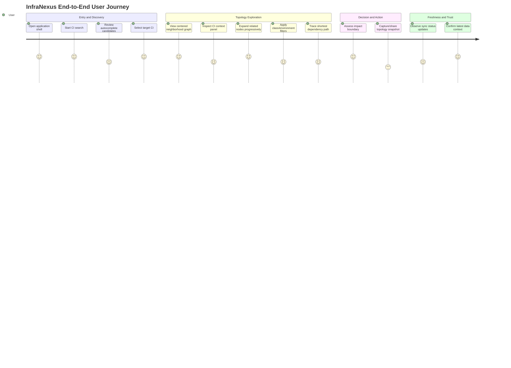
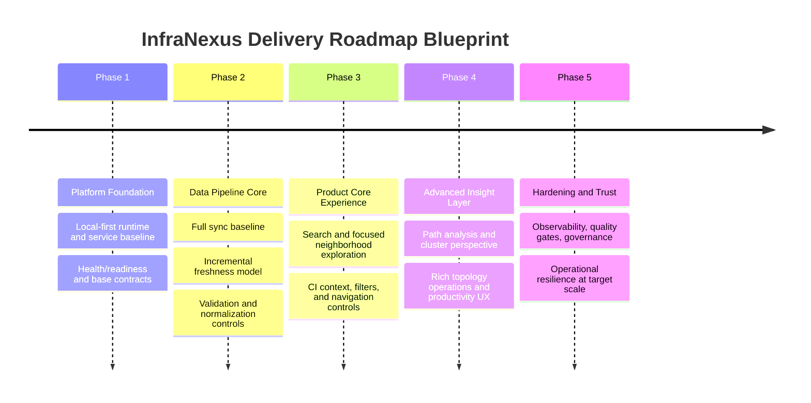
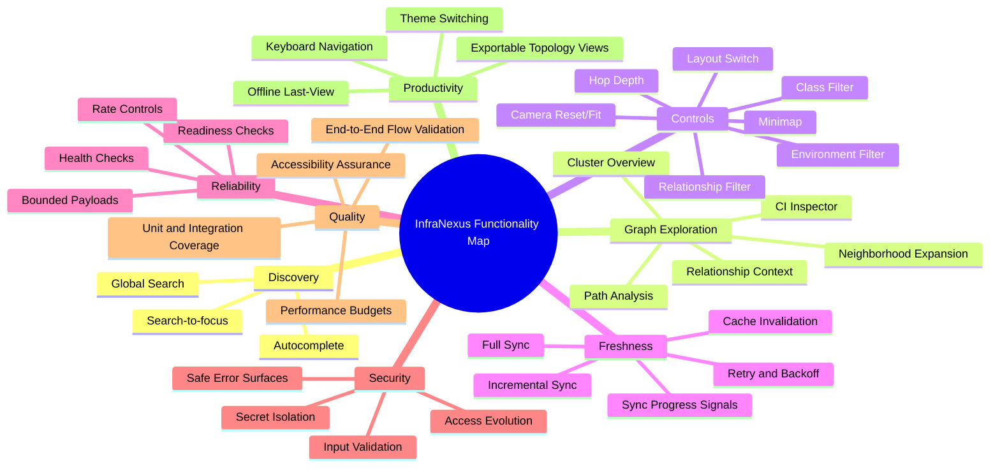

# InfraNexus End-to-End Picture File

This file is the single visual blueprint view of the product using Mermaid diagrams.

## 1) End-to-End System Picture

## 2) Data Lifecycle Picture

## 3) User Journey Picture

## 4) Delivery Roadmap Picture

## 5) Functionality Map Picture

